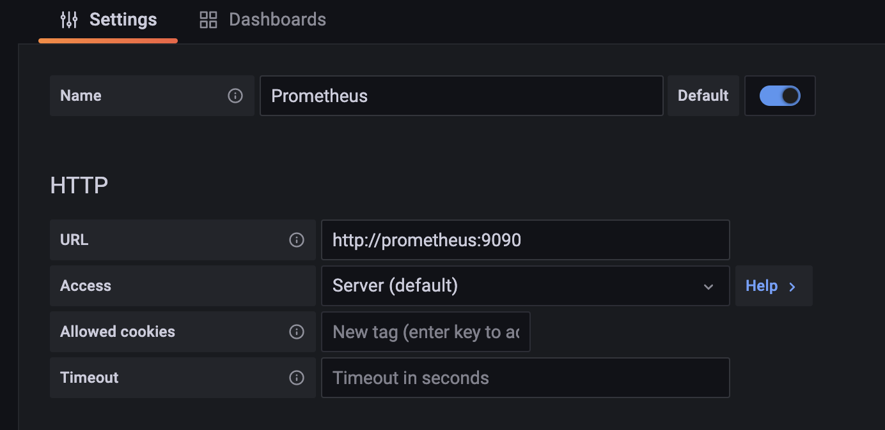
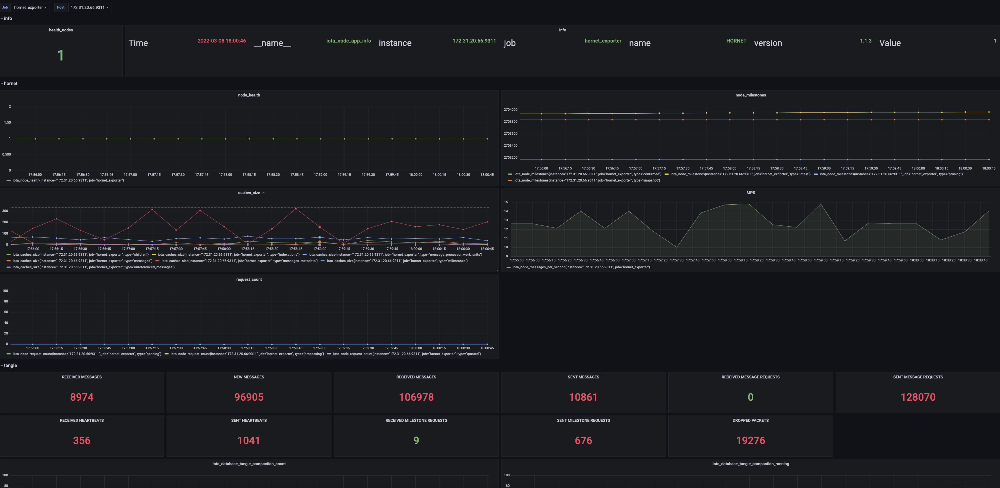

## Datasource Settings
if you set up a monitor server by using [monitor](../monitor/), you can easily set a Prometheus data source by the following graph.

## Node Dashboard
[hornet](../hornet/) script will set up a hornet node with an official node-exporter, so you can easily import the official dashboard for node monitoring.

dashboard url: https://grafana.com/grafana/dashboards/1860

## Hornet Dashboard
Hornet node has embedded a Prometheus exporter in the servers layer, if you enable the `Prometheus` plugin in Hornet's `config.json`, then you can use [hornet_dashboard](./template/hornet-dashboard.json), this dashboard helps you to monitor Hornet nodes more visually.

